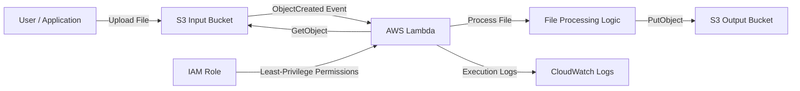

# 🚀 Event-Driven File-Processing Pipeline

> **An AWS serverless event-driven pipeline that automatically processes files uploaded to Amazon S3 using AWS Lambda.**

---

## 🏗️ Architecture



---

## 📌 Project Overview

This project demonstrates a **serverless, event-driven architecture on AWS**.

When a file is uploaded to the **S3 Input Bucket**, Amazon S3 automatically generates an `ObjectCreated` event. This event triggers an **AWS Lambda** function.

The Lambda function then:

1. 📥 Reads the uploaded file
2. ⚙️ Processes the file
3. 📊 Calculates file statistics
4. 📝 Generates a processed version
5. 📤 Stores the result in the S3 Output Bucket
6. 📊 Records execution logs in CloudWatch

---

## ☁️ AWS Services Used

| Service                  | Purpose                                        |
| ------------------------ | ---------------------------------------------- |
| 🪣 **Amazon S3**         | Stores input and processed files               |
| λ **AWS Lambda**         | Executes serverless processing logic           |
| 🔐 **AWS IAM**           | Controls permissions using least privilege     |
| 📊 **Amazon CloudWatch** | Stores Lambda execution logs                   |
| 💻 **AWS CLI**           | Creates, configures, and manages AWS resources |

---

## 🔄 Event Flow

```text
User / Application
        │
        │ Upload File
        ▼
S3 Input Bucket
        │
        │ ObjectCreated Event
        ▼
AWS Lambda
        │
        │ GetObject
        ▼
File Processing
        │
        │ PutObject
        ▼
S3 Output Bucket
        │
        ▼
Processed File
```

---

## ⚙️ File Processing

The Lambda function analyzes the uploaded text file and generates a processed output containing:

* 📄 Original filename
* 📦 Original file size
* 🔢 Character count
* 📝 Word count
* 🕐 Processing timestamp
* 📋 Original file content

### 📄 Example Output

```text
PROCESSED FILE
===============

Original file: summary-test.txt
Original size: 54 bytes
Character count: 54
Word count: 6
Processed at: <UTC timestamp>

Original content:
Testing the updated event-driven processing pipeline.
```

---

## 🔐 Security & IAM

The project follows the **Principle of Least Privilege**.

### 🪣 Input Bucket

Lambda has permission to:

```text
s3:GetObject
```

Only for objects inside the input bucket.

### 🪣 Output Bucket

Lambda has permission to:

```text
s3:PutObject
```

Only for processed objects under:

```text
processed/*
```

### 📊 CloudWatch

Lambda uses:

```text
AWSLambdaBasicExecutionRole
```

for CloudWatch logging.

---

## 🧪 Testing

The pipeline was tested with multiple files to verify the complete event-driven workflow.

### ✅ Tests Performed

* 📤 S3 file upload
* ⚡ Automatic S3 → Lambda triggering
* 📥 Lambda file retrieval
* ⚙️ File processing
* 📊 File statistics generation
* 📄 Processed output creation
* 🔄 Multiple file processing
* 📊 CloudWatch log verification
* 🔐 IAM permission verification

### 🔬 Example Test

```text
Upload pipeline-test.txt
        ↓
S3 ObjectCreated Event
        ↓
AWS Lambda
        ↓
Read Input File
        ↓
Process File
        ↓
Store Processed File
        ↓
S3 Output Bucket
        ↓
processed/pipeline-test.txt
```

---

## 📁 Project Structure

```text
event-driven-file-processing-pipeline/
│
├── README.md
├── .gitignore
│
├── docs/
│   └── architecture.md
│
├── input/
│   ├── automatic-test.txt
│   ├── file-one.txt
│   ├── file-two.txt
│   ├── pipeline-test.txt
│   ├── summary-test.txt
│   └── test.txt
│
├── output/
│   ├── pipeline-test.txt
│   └── summary-test.txt
│
├── lambda/
│   └── index.py
│
├── lambda-trust-policy.json
├── s3-notification.json
├── s3-processing-policy.json
├── s3-read-policy.json
└── test-event.json
```

---

## 🛠️ Technologies

* 🐍 **Python 3.12**
* ☁️ **AWS Lambda**
* 🪣 **Amazon S3**
* 🔐 **AWS IAM**
* 📊 **Amazon CloudWatch**
* 💻 **AWS CLI**
* 🔀 **Git**
* 🐙 **GitHub**
* 📐 **Mermaid**

---

## 🎯 Learning Outcomes

Through this project, I gained hands-on experience with:

* ⚡ Event-driven AWS architecture
* ☁️ Serverless application design
* 🪣 S3 event notifications
* λ AWS Lambda
* 📥 S3 object operations
* 🔐 IAM least-privilege security
* 📊 CloudWatch monitoring
* 💻 AWS CLI
* 🐍 Python-based AWS development
* 🔗 S3 → Lambda integration
* 🧪 Testing and troubleshooting AWS services

---

## 💡 Key Takeaway

> 🚀 **This project demonstrates how AWS services can be combined to build an event-driven serverless workflow where uploading a file automatically triggers processing without requiring a continuously running server.**

---

## 👨‍💻 Author

**Shubham Gorule**

🎓 BCA Student | ☁️ Aspiring Cloud Engineer | 🚀 AWS • Linux • Networking • DevOps

🐙 **GitHub:** [jupiterian23](https://github.com/jupiterian23)

---

⭐ **If you found this project useful, consider giving it a star!**
